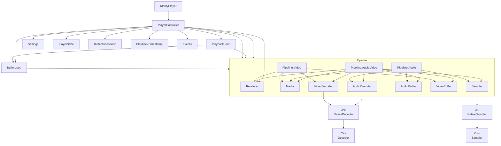
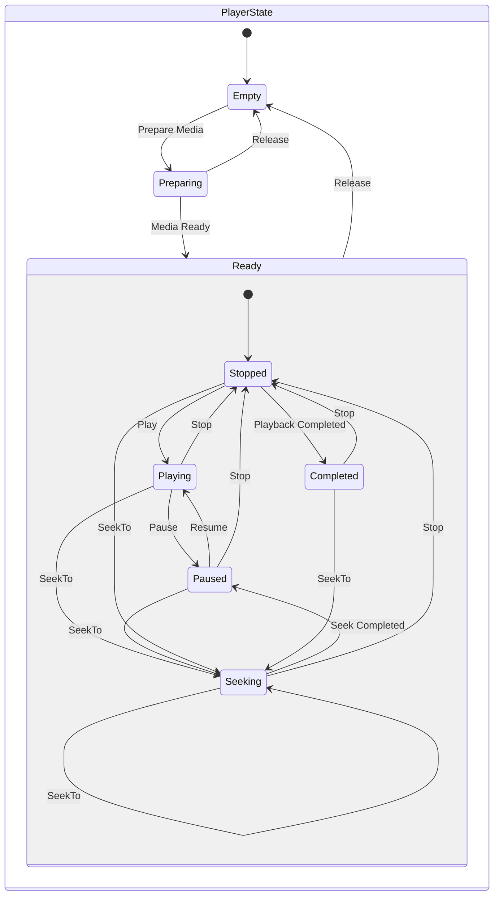

    
    
Klarity

Klarity is a library providing media player functionality written in Kotlin for developing Compose Desktop applications

---

- [Features](#features)
- [Architecture](#architecture)
    - [Dependency graph](#dependency-graph)
    - [State diagram](#state-diagram)
    - [Transition table](#transition-table)
- [Supported formats](#supported-formats)
- [Modules](#modules)
    - [Core](#core)
    - [Compose](#compose)
    - [Example](#example)
- [Components](#components)
- [Usage](#usage)

# Features

- Media playback (audio, video)
- Change playback speed with time stretching (without affecting pitch)
- Continuous preview for timeline-like features
- Creation of snapshots by timestamps
- Coroutines/Flow based API
- Compose video rendering

# Architecture

## Dependency graph

## State diagram

## Transition table

| Current State \ Target State | Empty | Preparing | Ready (Stopped) | Ready (Playing) | Ready (Paused) | Ready (Completed) | Ready (Seeking) | Released |
|------------------------------|-------|-----------|-----------------|-----------------|----------------|-------------------|-----------------|----------|
| **Empty**                    | N/A   | Prepare   | N/A             | N/A             | N/A            | N/A               | N/A             | N/A      |
| **Preparing**                | N/A   | N/A       | Media Ready     | N/A             | N/A            | N/A               | N/A             | Release  |
| **Ready (Stopped)**          | N/A   | N/A       | N/A             | Play            | N/A            | N/A               | SeekTo          | Release  |
| **Ready (Playing)**          | N/A   | N/A       | Stop            | N/A             | Pause          | N/A               | SeekTo          | N/A      |
| **Ready (Paused)**           | N/A   | N/A       | Stop            | Resume          | N/A            | N/A               | SeekTo          | N/A      |
| **Ready (Completed)**        | N/A   | N/A       | Stop            | N/A             | N/A            | N/A               | SeekTo          | N/A      |
| **Ready (Seeking)**          | N/A   | N/A       | Stop            | N/A             | Seek Completed | N/A               | SeekTo          | N/A      |

# Supported formats

[Full list of formats supported by FFmpeg](https://ffmpeg.org/ffmpeg-formats.html)

# Modules

## Core

> Contains basic components such as: controller, player, preview manager, snapshot manager

### Dependencies

- [klarity-decoder](https://github.com/numq/klarity-decoder)
    - [FFmpeg](https://www.ffmpeg.org/)

- [klarity-sampler](https://github.com/numq/klarity-sampler)
    - [PortAudio](https://github.com/PortAudio/portaudio/)
    - [Signalsmith Audio](https://github.com/Signalsmith-Audio/signalsmith-stretch)

## Compose

> Contains a Compose component for rendering video

### Dependencies

- [Core Module](#core)

## Example

> Contains a demo application

### Dependencies

- [Core Module](#core)
- [Compose Module](#compose)

To run demo application place the binaries appropriate to your platform into the `example/bin` folder and run
the [Application](example/src/main/kotlin/application/Application.kt).

## Components

- [KlarityPlayer](core/src/main/kotlin/player/KlarityPlayer.kt) - contains the media player logic.
- [SnapshotManager](core/src/main/kotlin/snapshot/SnapshotManager.kt) - allows to get frames (snapshots) with a
  specified timestamp once per session. Use case - previewing keyframes.
- [PreviewManager](core/src/main/kotlin/preview/PreviewManager.kt) - allows to get frames (snapshots) with a
  specific timestamp during a continuous session. Use case - previewing the timeline.
- [Renderer](compose/src/main/kotlin/renderer/Renderer.kt) - Provides functionality for rendering background and
  foreground.

## Usage

- Load binaries using the [Klarity](core/src/main/kotlin/library/Klarity.kt) loader object
  > Binaries must be located in the filesystem, however, they can be part of a jar - for this the binaries must be
  opened
  > as temporary files whose path can be used by the loader.
- Use the necessary components