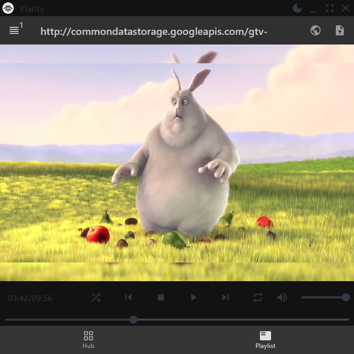
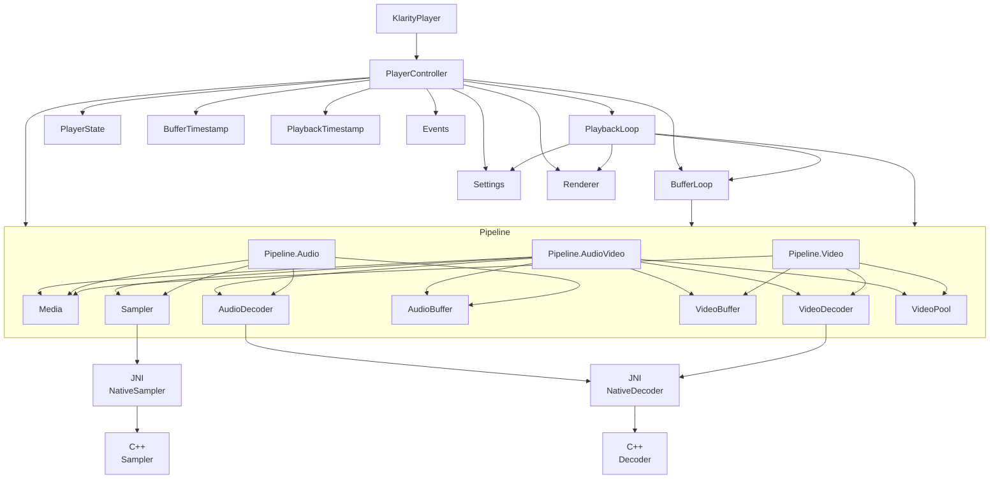
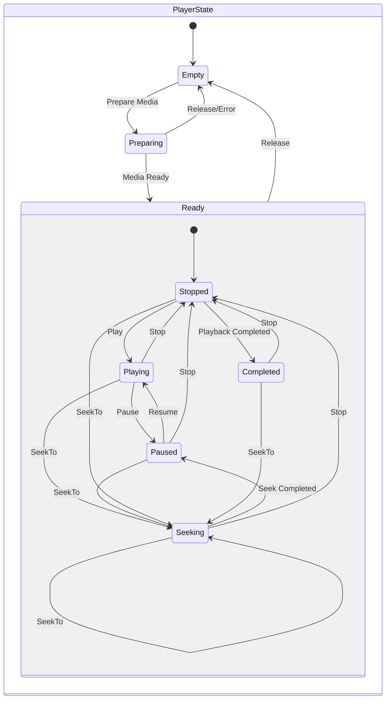

<a href="https://www.buymeacoffee.com/numq"></a>

<div align="center">
<h1>Klarity</h1>

</div>

### Klarity is a media layer for Jetpack Compose Desktop, written in Kotlin and C++, built on native FFMpeg and PortAudio libraries, and rendered using the Skiko library.

<div align="center">

</div>

---

## Table of Content

* [Supported operating systems](#supported-operating-systems)
* [Features](#features)
* [Architecture](#architecture)
    * [Dependency graph](#dependency-graph)
    * [State diagram](#state-diagram)
    * [Transition table](#transition-table)
* [Installation](#installation)
* [Usage](#usage)
* [Used libraries](#used-libraries)

# Supported operating systems

- Windows x64
- Linux x64
- macOS x64

# Features

- Media files probing
- Audio and video playback of media files
- Slow down and speed up playback speed without changing pitch
- Getting a preview of a media file
- Getting frames (snapshots) of a media file
- Using Coroutine/Flow API

## Architecture

### Dependency graph



### State diagram



### Transition table

| Current State \ Target State | Empty         | Preparing | Ready (Stopped) | Ready (Playing) | Ready (Paused) | Ready (Completed) | Ready (Seeking) |
|------------------------------|---------------|-----------|-----------------|-----------------|----------------|-------------------|-----------------|
| **Empty**                    | N/A           | Prepare   | N/A             | N/A             | N/A            | N/A               | N/A             |
| **Preparing**                | Release/Error | N/A       | Media Ready     | N/A             | N/A            | N/A               | N/A             |
| **Ready (Stopped)**          | Release       | N/A       | N/A             | Play            | N/A            | N/A               | SeekTo          |
| **Ready (Playing)**          | N/A           | N/A       | Stop            | N/A             | Pause          | N/A               | SeekTo          |
| **Ready (Paused)**           | N/A           | N/A       | Stop            | Resume          | N/A            | N/A               | SeekTo          |
| **Ready (Completed)**        | N/A           | N/A       | Stop            | N/A             | N/A            | N/A               | SeekTo          |
| **Ready (Seeking)**          | N/A           | N/A       | Stop            | N/A             | Seek Completed | N/A               | SeekTo          |

## Installation

Download the [latest release](https://github.com/numq/Klarity/releases/tag/1.0.0) and include jar files to your project
depending on your system.

## Usage

> [!NOTE]
> Check out the example to see a full implementation in Clean Architecture using the Reduce & Conquer pattern.

### Load library

- The `KlarityPlayer.load()` method should be called once during the application lifecycle

```kotlin
KlarityPlayer.load().onFailure { t -> }.getOrThrow()
```

### Get probe (information about a [media](library/src/main/kotlin/io/github/numq/klarity/media/Media.kt))

```kotlin
val media = ProbeManager.probe("path/to/media").onFailure { t -> }.getOrThrow()
```

## Get video frames (snapshots)

> [!IMPORTANT]
> [Snapshot](library/src/main/kotlin/io/github/numq/klarity/snapshot/Snapshot.kt) must be closed using the `close()`
> method.

```kotlin
val snapshots = SnapshotManager.snapshots("path/to/media") { timestamps }.onFailure { t -> ... }.getOrThrow()

snapshots.forEach { snapshot ->
    snapshot.close().onFailure { t -> }.getOrThrow()
}

val snapshot = SnapshotManager.snapshot("path/to/media") { timestamp }.onFailure { t -> ... }.getOrThrow()

snapshot.close().onFailure { t -> }.getOrThrow()
```

## Get preview frames (for example, for the timeline)

> [!IMPORTANT]
> [PreviewManager](library/src/main/kotlin/io/github/numq/klarity/preview/PreviewManager.kt) must be closed using the
`close()` method.

```kotlin
val previewManager = PreviewManager.create("path/to/media").onFailure { t -> ... }.getOrThrow()

previewManager.render(renderer, timestamp).onFailure { t -> }.getOrThrow()

previewManager.close().onFailure { t -> }.getOrThrow()
```

### Get media file played

> [!IMPORTANT]
> [KlarityPlayer](library/src/main/kotlin/io/github/numq/klarity/player/KlarityPlayer.kt)
> and [Renderer](library/src/main/kotlin/io/github/numq/klarity/renderer/Renderer.kt) must be closed using the
`close()` method

```kotlin
val player = KlarityPlayer.create().onFailure { t -> }.getOrThrow()

val format = checkNotNull(player.state.media.videoFormat)

val renderer = Renderer.create(format).onFailure { t -> }.getOrThrow()

player.attach(renderer).getOrThrow()

player.prepare("path/to/media").onFailure { t -> }.getOrThrow()

player.play().onFailure { t -> }.getOrThrow()

player.stop().onFailure { t -> }.getOrThrow()

player.close().onFailure { t -> }.getOrThrow()

renderer.close().onFailure { t -> }.getOrThrow()
```

## Used libraries

- [FFMPEG](https://ffmpeg.org/)
- [PortAudio](https://www.portaudio.com/)
- [Signalsmith Stretch](https://github.com/Signalsmith-Audio/signalsmith-stretch/)
- [Skiko](https://github.com/JetBrains/skiko/)