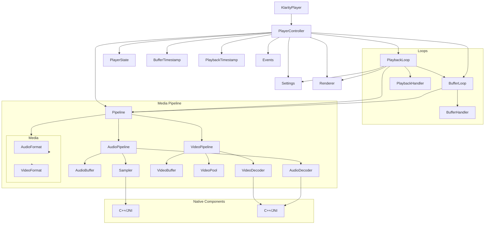
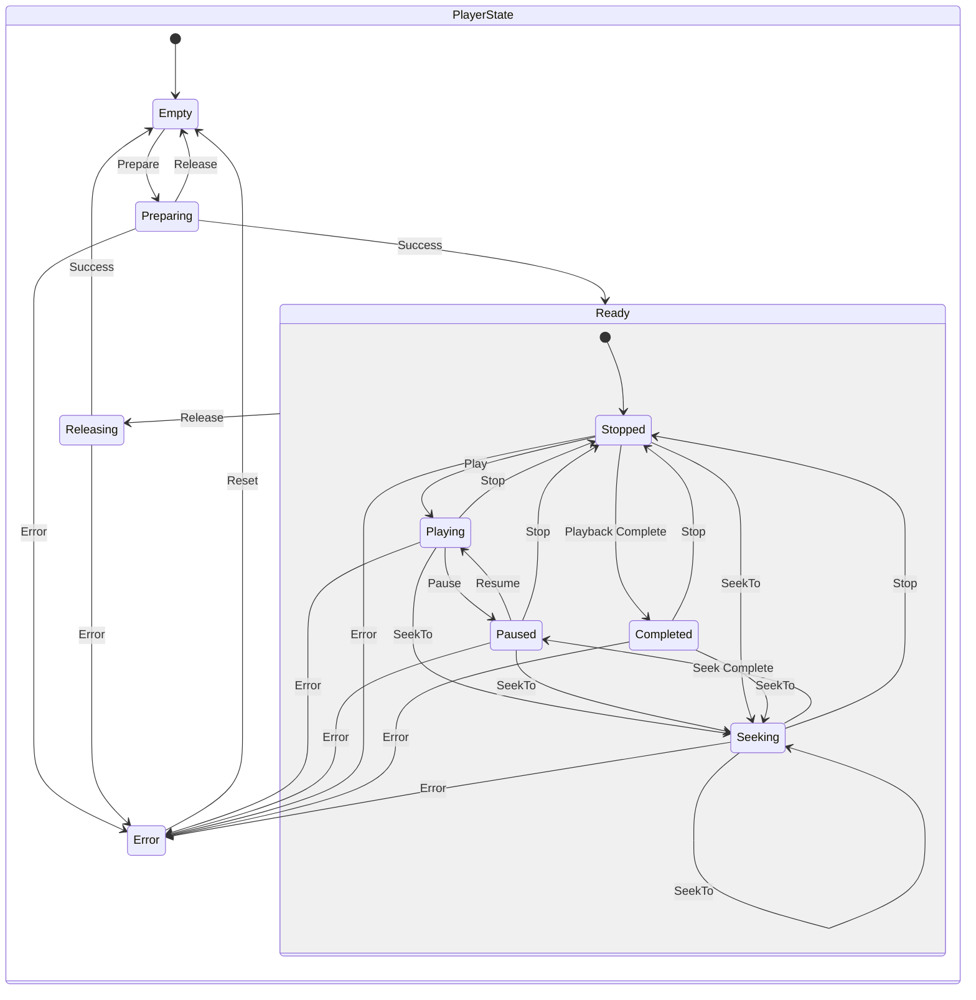

[](https://coff.ee/numq)

<div align="center">
<h1>Klarity</h1>

</div>

**Klarity** is a media (video and audio) player for **Compose Multiplatform** (desktop-only), built on top of the
native **FFMpeg** and **PortAudio** libraries, and rendered using the **Skiko** library.

Since frames are rendered directly into the `Composable`, this eliminates the need for compatibility components like
`SwingPanel`, making it possible to display any `Composable` as an overlay on top of a frame.

<br>

<div align="center">

</div>

## Table of Content

* [Changelog](#changelog)
* [Supported platforms](#supported-platforms)
* [Custom builds](#custom-builds)
* [Features](#features)
* [Roadmap](#roadmap)
* [Architecture](#architecture)
    * [Layers](#layers)
    * [Rendering](#rendering)
    * [Dependency graph](#dependency-graph)
    * [State diagram](#state-diagram)
    * [Transition table](#transition-table)
* [Installation](#installation)
* [Usage](#usage)
* [Third-party libraries](#third-party-libraries)

# Changelog

## [1.0.6](https://github.com/numq/Klarity/releases/tag/1.0.6)

### Fixed

- Video-only media playback synchronization

___

<details>
<summary>📦 Previous versions</summary>

## [1.0.5](https://github.com/numq/Klarity/releases/tag/1.0.5)

> [!WARNING]  
> Video-only media playback synchronization doesn't work

### Changed

- Code refactoring
- Performance optimizations

### Fixed

- Bug fixes and stability improvements

## [1.0.4](https://github.com/numq/Klarity/releases/tag/1.0.4)

### Changed

- Renderer no longer depends on video format - uses width and height instead

## [1.0.3](https://github.com/numq/Klarity/releases/tag/1.0.3)

### Fixed

- Fixed incorrect argument names

### Changed

- Enhanced seeking precision
- Extended external state machine
- Changed rendering behavior - renders first video frame during: preparation, playback stop, seeking
- Performance and stability enhancements

## [1.0.2](https://github.com/numq/Klarity/releases/tag/1.0.2)

### Fixed

- Fixed delayed external state updates after command execution
- Fixed incorrect first frame display after seeking
- Fixed event handling issues
- Fixed improper loop stopping
- Fixed buffer cleanup errors during channel closure

## [1.0.1](https://github.com/numq/Klarity/releases/tag/1.0.1)

### Changed

- Improved internal state machine
- Improved playback synchronization
- Improved seeking

## [1.0.0](https://github.com/numq/Klarity/releases/tag/1.0.0)

- Stable release

</details>

# Supported platforms

**The library provides pre-built JARs for the following platforms:**

| Platform | Architecture | JAR                         |
|----------|--------------|-----------------------------|
| Windows  | x64          | `klarity-windows-x64-*.jar` |
| Linux    | x64          | `klarity-linux-x64-*.jar`   |
| macOS    | x64          | `klarity-macos-x64-*.jar`   |
| macOS    | arm64        | `klarity-macos-arm64-*.jar` |

# Custom builds

If you need support for other platforms or architectures, you can build the library from source using
the [CI/CD configuration](.github/workflows/build.yml) as a reference for the complete build process.

# Features

- Media files probing
- Audio and video playback of media files
- Slow down and speed up playback speed without changing pitch
- Getting a preview of a media file
- Getting frames (snapshots) of a media file
- Coroutine/Flow API

# Roadmap

## Hardware-Accelerated Rendering

While hardware-accelerated decoding is technically available through FFmpeg, its practical application is currently
limited:

- Rendering bottleneck: Decoded frames are processed through CPU-bound Skia components

- Latency issues: This creates a pipeline bottleneck that negates the benefits of hardware decoding

- Architectural constraints: DirectX 12 and OpenGL implementations would require compatibility components, eliminating
  key advantages of the current architecture

Future solution:

- Implement Vulkan-based rendering when stable support becomes available in Skia, provided it maintains
  the current seamless Compose integration without compatibility layers.

## Architecture

Klarity implements an event-driven architecture designed for Kotlin developers. It focuses on simplicity and easy
integration with minimal setup.

### Layers

- **JVM Layer (Kotlin):**

    - Contains all business logic and state management

    - Provides a modern, coroutine-based public API

    - Uses Kotlin Flows for event-driven communication

    - Manages playback control, seeking, and synchronization

- **JNI Layer:**:

    - Bridges Kotlin code with native C++ performance

    - Handles efficient data marshaling between layers

    - Minimizes overhead for data transfer

- **Native Layer (C++):**

    - Uses FFmpeg for video/audio decoding

    - Employs PortAudio for low-latency audio playback

    - Handles audio playback including polyphonic audio time-stretching

### Rendering

The pipeline combines `FFmpeg` and `Skia` to decode video frames directly into native memory. The decoded frame data is
directly interpreted as a `Pixmap` via pointer reference, then written to a `Skia Surface` and rendered to a
`Compose Canvas`.

This efficient approach eliminates compatibility layers like `SwingPanel` and enables seamless overlaying of any
`Composable` on top of video content.

### Dependency graph



### State diagram



### Transition table

| Current State \ Action | Empty   | Preparing | Releasing | Ready.Stopped | Ready.Playing | Ready.Paused  | Ready.Completed   | Ready.Seeking | Error |
|------------------------|---------|-----------|-----------|---------------|---------------|---------------|-------------------|---------------|-------|
| Empty                  | -       | Prepare   | -         | -             | -             | -             | -                 | -             | -     |
| Preparing              | Release | -         | -         | Success       | -             | -             | -                 | -             | Error |
| Releasing              | Success | -         | -         | -             | -             | -             | -                 | -             | Error |
| Error                  | Reset   | -         | -         | -             | -             | -             | -                 | -             | -     |
| Ready.Stopped          | -       | -         | Release   | -             | Play          | -             | Playback Complete | SeekTo        | Error |
| Ready.Playing          | -       | -         | Release   | Stop          | -             | Pause         | -                 | SeekTo        | Error |
| Ready.Paused           | -       | -         | Release   | Stop          | Resume        | -             | -                 | SeekTo        | Error |
| Ready.Completed        | -       | -         | Release   | Stop          | -             | -             | -                 | SeekTo        | Error |
| Ready.Seeking          | -       | -         | Release   | Stop          | -             | Seek Complete | -                 | SeekTo        | Error |

## Installation

Download the [latest release](https://github.com/numq/Klarity/releases/tag/1.0.1) and include jar files to your project
depending on your system.

## Usage

> [!NOTE]
> Check out the [example](example/composeApp/src/commonMain/kotlin/io/github/numq/example) to see a full implementation
> in Clean Architecture using the [Reduce & Conquer](https://github.com/numq/reduce-and-conquer) pattern

### Load library

- The `KlarityPlayer.load()` method should be called once during the application lifecycle

```kotlin
KlarityPlayer.load().onFailure { t -> }.getOrThrow()
```

### Get probe (information about a [media](library/src/main/kotlin/io/github/numq/klarity/media/Media.kt))

```kotlin
val media = ProbeManager.probe("path/to/media").onFailure { t -> }.getOrThrow()
```

### Get video frames (snapshots)

> [!IMPORTANT]
> [Snapshot](library/src/main/kotlin/io/github/numq/klarity/snapshot/Snapshot.kt) must be closed using the `close()`
> method

```kotlin
val snapshots = SnapshotManager.snapshots("path/to/media") { timestamps }.getOrThrow()

snapshots.forEach { snapshot ->
    renderer.render(snapshot.frame).getOrThrow()

    snapshot.close().getOrThrow()
}

val snapshot = SnapshotManager.snapshot("path/to/media") { timestamp }.getOrThrow()

renderer.render(snapshot.frame).getOrThrow()

snapshot.close().getOrThrow()
```

## Get preview frames (for example, for the timeline)

> [!IMPORTANT]
> [PreviewManager](library/src/main/kotlin/io/github/numq/klarity/preview/PreviewManager.kt) must be closed using the
`close()` method

```kotlin
val previewManager = PreviewManager.create("path/to/media").getOrThrow()

previewManager.render(renderer, timestamp).getOrThrow()

previewManager.close().getOrThrow()
```

### Get media file played

> [!IMPORTANT]
> [KlarityPlayer](library/src/main/kotlin/io/github/numq/klarity/player/KlarityPlayer.kt)
> and [Renderer](library/src/main/kotlin/io/github/numq/klarity/renderer/Renderer.kt) must be closed using the
`close()` method

```kotlin
val player = KlarityPlayer.create().getOrThrow()

val probe = ProbeManager.probe("path/to/media").getOrThrow()

val renderer = probe.videoFormat?.run { Renderer.create(width = width, height = height).getOrThrow() }

if (renderer != null) {
    player.attachRenderer(renderer).getOrThrow()
}

player.prepare("path/to/media").getOrThrow()

player.play().getOrThrow()

player.stop().getOrThrow()

player.detachRenderer().getOrThrow()?.close()?.getOrThrow()

player.close().getOrThrow()
```

## Third-party libraries

- **[FFmpeg](https://ffmpeg.org/)** - Licensed under [LGPLv2.1](licenses/FFMPEG_LICENSE)
- **[PortAudio](https://www.portaudio.com/)** - Licensed under [MIT License](licenses/PORTAUDIO_LICENSE)
- **[Signalsmith Stretch](https://github.com/Signalsmith-Audio/signalsmith-stretch/)** - Licensed
  under [MIT License](licenses/SIGNALSMITH_STRETCH_LICENSE)